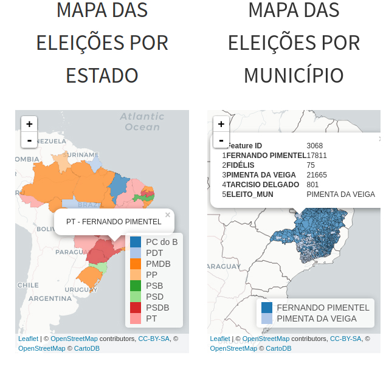
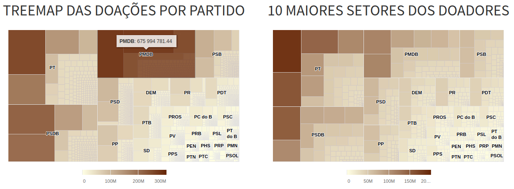
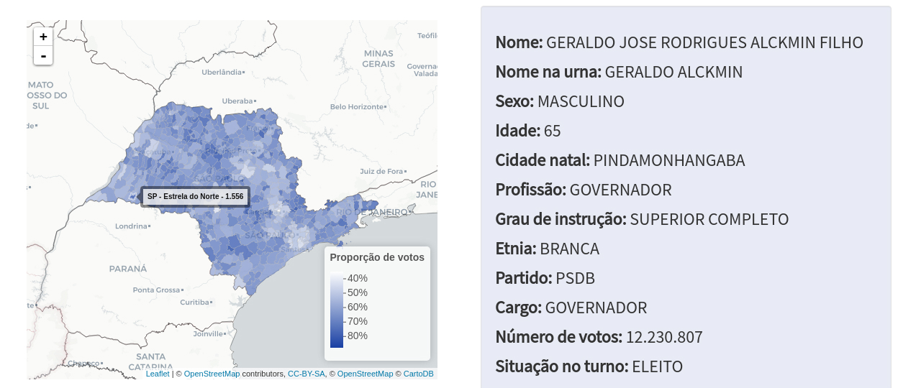
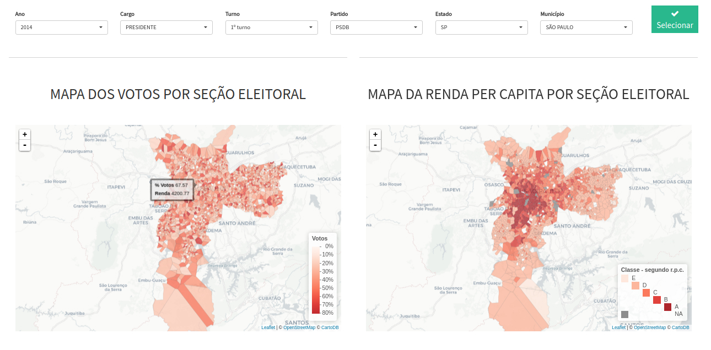

Sobre o voronoys
================

O VORONOYS é um grupo formado por 4 estatísticos e um cientista
político. Sua criação foi motivada pelo 1º Desafio do CEPESP Data da
FGV, no qual o objetivo é decifrar as eleições no Brasil através de
ferramentas de análise, visualização e busca em dados. O nome Voronoys é
oriundo de uma técnica matemática chamada Tesselação de Voronoi que foi
utilizada nas análises propostas pelo grupo.

Ideia geral
===========

A ideia do Voronoys é fornecer uma ferramenta de visualização diferente
das ferramentas convencionais. Para isso, foram utilizadas visualizações
atuais e interativas. Além disso, foram incorporados diferenciais de
análise tais como a utilização de dados referentes a doações aos
partidos políticos e o estudo das coligações entre os partidos.

Outro diferencial é a possibilidade de visualizar a votação em um nível
mais desagregado do que município. Para este propósito foi utilizada a
técnica da tesselação de Voronoi para se criar regiões ao entorno das
seções eleitorais.

Visualizações
=============

Ao entrar na página inicial o usuário pode optar por três diferentes
tipos de visualizações:

-   Eleições gerais
-   Partidos
-   Candidatos

Eleições gerais
---------------

Nesta aba o usuário tem acesso a resultados globais das eleições:

Partidos
--------

Nesta aba o usuário encontra diversas informações sobre os partidos
políticos:

Candidatos
----------

Na aba *Perfil do candidato* o usuário pode ver o mapa da votação e as
informações de cada um dos candidatos

Na aba *Perfil do eleitorado* o usuário escolhee uma cidade e observa
como se deu a votação de cada candidato. Além disso é possível observar
o mapa da renda das regiões da cidade. Para essa visualização foi
utilizada a técnica da tesselação de Voronoi. Com isso temos uma visão
mais granular da votação em cada município.

