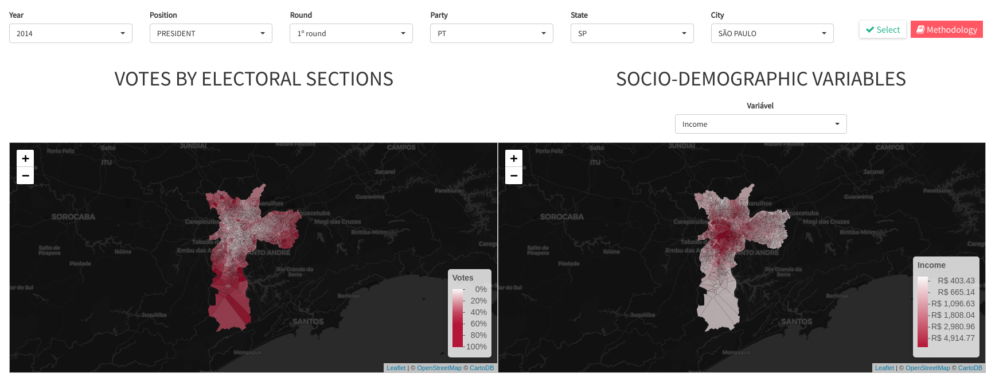
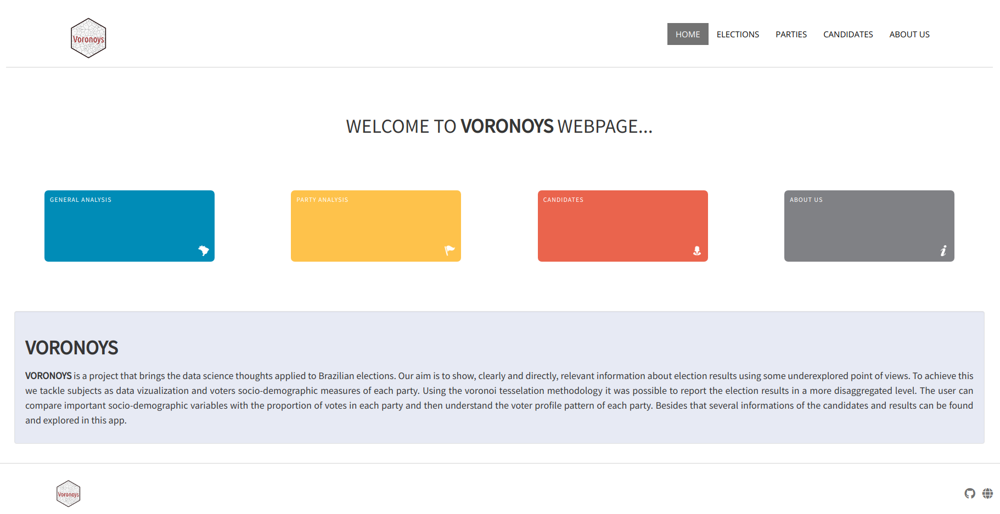
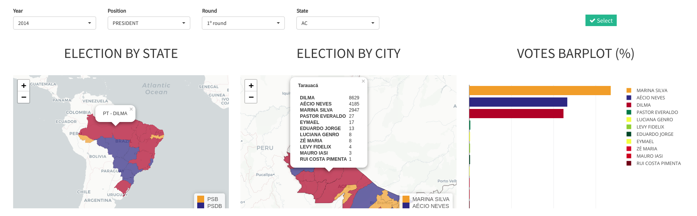
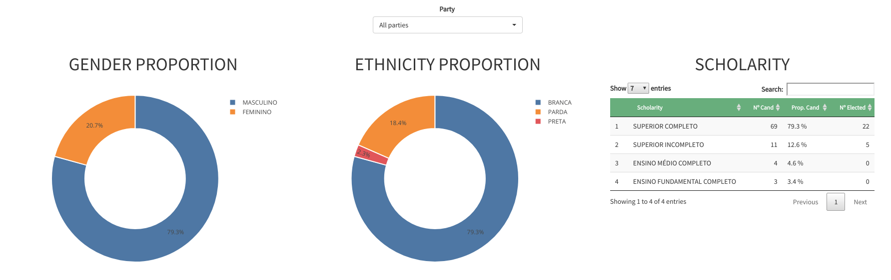
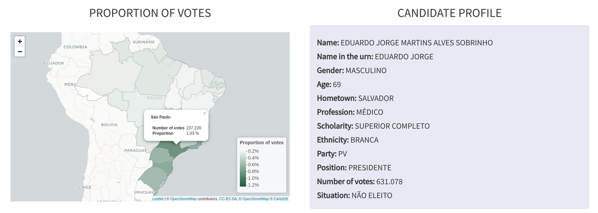
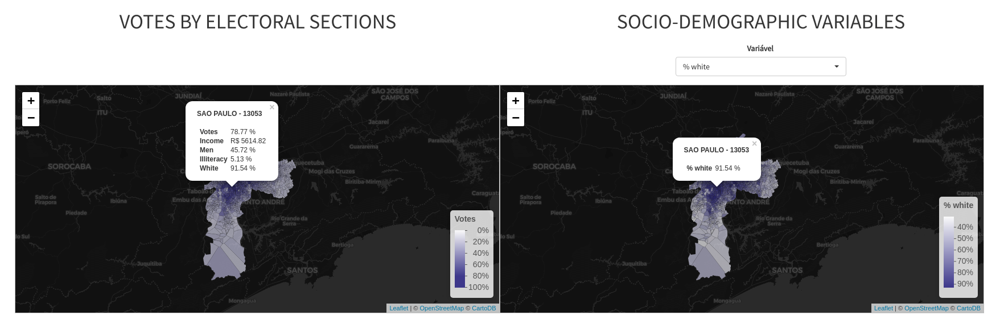

About the app
=============

*VORONOYS* is a group composed of 4 statisticians and a political
scientist. Its beginning was motivated by the first challenge of CEPES
Data, in which the main objective was to show new perspectives on the
Brazilian elections. The name is based on the mathematical technique
used in this work called Voronoi tessellation.

Links
=====

-   Live version: [Voronoys - Liveapp](https://voronoys.shinyapps.io/voronoys/) 
-   RStudio cloud: [Voronoys - RStudio cloud](https://voronoys.shinyapps.io/voronoys/) 
-   GitHub: [Voronoys - Github](https://github.com/voronoys/voronoys_sc)

Quick reading: Highlights
=========================

This tool provide to user a deep access to brazilian election results.
It is possible to create general maps, plots, and tables by states and
cities as well investigate some under reported analysis as the case of
the number of coalitions for example. As Brazil has nowadays 35 parties
the user have a huge number of possibilities of analisys in our tool.

Beside the general visualizations we also provide a new way to
investigate brazilian elections. In Brazil, electoral data has four main
aggregation levels, they are: the state, municipality, electoral zone
and electoral section. The lower level, which is the electoral sections,
does not have any administrative division, i.e., it is just an address
and not an area. Considering that socio-demographic variables can be
useful to explain the election outcome, we are interested in aggregate
such kind of data, provided by the Instituto Brasileiro de Geografia e
Estatistica (IBGE) in small areas called census sectors. The variables
extracted from the census sectors to the electoral sections are income,
household, illiteracy rate, proportion of white people, and proportion
of women. The outcome of interest, present on electoral section data, is
the proportion of votes in each party. Then it is possible to understand
the characteristics of voters of each party as well a smoothed result of
the election at a electoral section level (voronoi cells).

With this tool it is possible to check some hypothesys about
characteristics of each party voters. Is it true that low-income people
vote in left-wing parties? And white people? Feel free to check the
voters of our 35 parties!

General idea
============

Our main aim is to provide a non conventional tool to visualize
brazilian election in which the user is able to understand the
information clearly and directly. This way everyone is able to use and
understand this tool.

A differential of our app is the possibility to visualize brazilian
elections in a less agregated level. Nowadays the lowest areal level in
which we can analise election data is municipalities. We are providing a
way to visualize the elections inside each city because we believe that
big cities have a huge variety of realities and then a unique score for
each city is not representative. To visualize the results in each city
we used the voronoi tesseletaion technique to create polygons using by
indexes the address of electoral sections in São Paulo state.

We assumed that voters prefer to vote near their houses. Then using
censitary informations we can contrast two layers of polygons: 1)
censitary regions; 2) voronoi cells created using electoral sections.
Then it is possible to compare populations of different parties and
understand their main characteristics.

Visualizations
==============

The first screen give to user four tabs:

General analisys
----------------

in this tab the user can find visualizations at federal and state level.
Winners by state/city and number of votes of each candidate are some
examples of outputs in this tab.

Parties
-------

Here it is possible to understand how political parties are related in
federal and state level. The parties more represented in each state,
coalitions, and socio-demographic information of the politicians in each
party are some example of outputs in this tab.

Candidates
----------

Here it is to see the voronoi methodology in pratice and also personal
information of each politician. Socio-demographic information of parties
voters and votes by city of each politician are some example of outputs
in this tab.

We have restricted data for the years 2014 and 2016 for operational
reasons.
