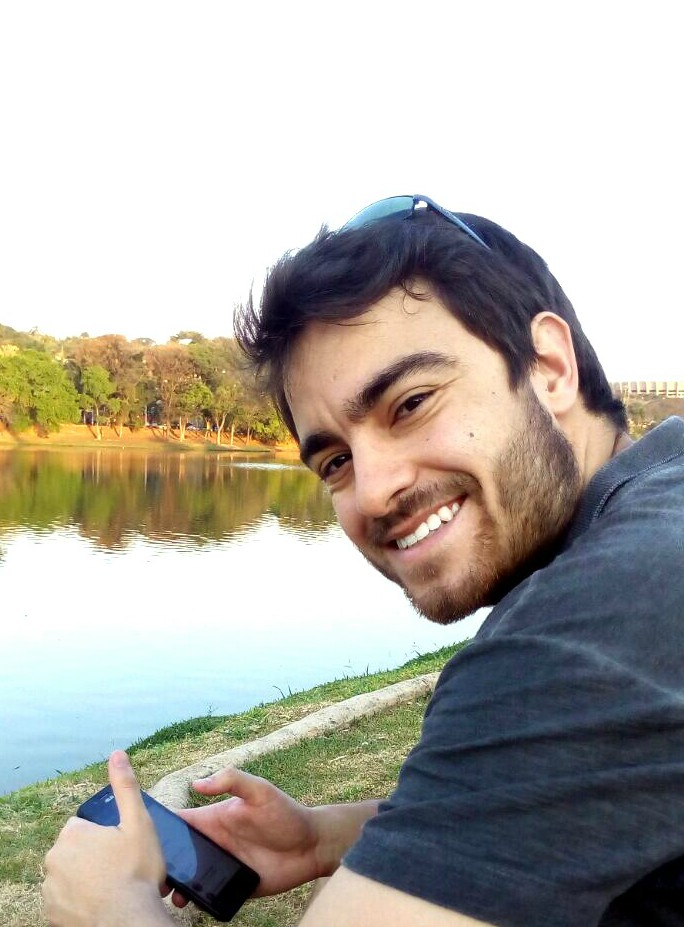

# Augusto Marcolin

<!-- Duas colunas -->

### Description

Currently, I’m Data Scientist at Agibank in the credit department. My activities are related with fraud detection, credit risk, debt collection, among other common tasks of a data scientist as ETL, data visualization and etc. Previously, I worked at 4all in the field of digital marketing, I used to build machine learning models to predict churn, customer life cycle and recommendation engines. Also, I teach R computing in a MBA course at Laureate International Universities - Uniritter.

I obtained my MSc in Statistics from the Federal University of Minas Gerais (UFMG) and my bachelor degree in statistics from Federal University of Rio Grande do Sul (UFRGS).

***

### Interests

* Machine Learning
* Data Visualization
* Bayesian Inference
* Financial Statistics

***

  <a href="https://www.linkedin.com/in/augusto-marcolin-1114a1b5/"> 
    <i class="fa fa-linkedin" style='font-size:20px; margin: 0px 5px'></i>
  </a>
  <a href="https://github.com/augustomarcolin"> 
    <i class="fa fa-github" style='font-size:20px; margin: 0px 5px'></i>
  </a>
  <a href="https://twitter.com/"> 
    <i class="fa fa-twitter" style='font-size:20px; margin: 0px 5px'></i>
  </a>

