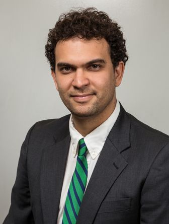

# Felipe Nunes

<!-- Duas colunas -->

### Description

He holds a degree in Social Sciences (2006) and a Master’s Degree in Political Science (2009) from the Federal University of Minas Gerais (UFMG). He holds a Master’s degree in Political Science from the University of California, Los Angeles (UCLA) as well, where he also studied Master of Science in Statistics and PhD in Political Science. He is a Fellow of CAPES/Fulbright and a researcher at the Nucleus of Legislative Studies of UFMG. He has experience in the area of Political Science, with emphasis on research design, working mainly on the following topics: parliamentary behavior, executive-legislative relationship, distributive politics, and parties in Latin America.

<!-- *** -->

<!-- ### Interests -->

<!-- * Estatístca Computacional -->
<!-- * Visualização de Dados  -->
<!-- * Estatística Espacial  -->
<!-- * Modelagem Estatística -->

***

  <a href="https://www.linkedin.com/in/felipe-nunes-31772453/"> 
    <i class="fa fa-linkedin" style='font-size:20px; margin: 0px 5px'></i>
  </a>
  <a href="https://github.com/DouglasMesquita"> 
    <i class="fa fa-github" style='font-size:20px; margin: 0px 5px'></i>
  </a>
  <a href="https://twitter.com/"> 
    <i class="fa fa-twitter" style='font-size:20px; margin: 0px 5px'></i>
  </a>

