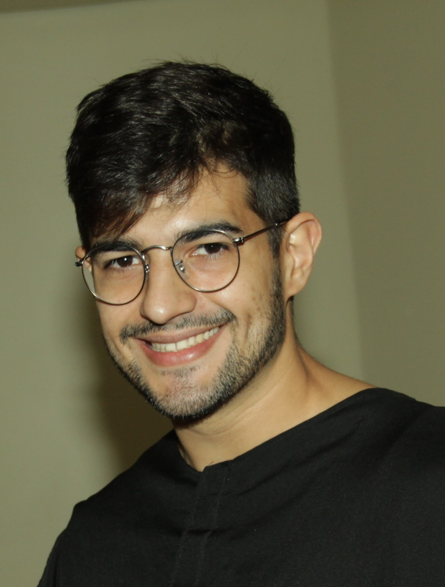

# Lucas Godoy

<!-- Duas colunas -->

### Description

I’m a statistics student in Brazil with a Bachelor degree from the Federal Uniersity of Rio Grande do Sul (UFRGS) and an expected MS from Federal university of Minas Gerais (UFMG), under the guidance of Dr. Renato Assuncao. In my undergraduate course I worked with geostatistical models for count data, comparing the algorithms from three different R packages, geoRglm, geoCount and Stan. The motivation for this study was a project called AMBES funded by the Brazilian public oil company PETROBRAS. I worked applying geostatistical models in support to researchers from other areas. Currently, I’ve been developing a Monte Carlo test applied to a specific problem proposed by researchers from ESRI, the ArcGIS company, with whom my MS advisor keeps contact. Although I’ve been working mainly with Spatial Statistics, I am also interested in Bayesian Inference, Computational Statistics, strategies to work with big datasets and performance improvement.

***

### Interests

* Applied Statistics 
* Computational Statistics
* Spatial Statistics
* Bayesian Inference

***

  <a href="https://www.linkedin.com/in/godoy-lucas/"> 
    <i class="fa fa-linkedin" style='font-size:20px; margin: 0px 5px'></i>
  </a>
  <a href="https://github.com/lcgodoy"> 
    <i class="fa fa-github" style='font-size:20px; margin: 0px 5px'></i>
  </a>
  <a href="https://twitter.com/godoy_lusca"> 
    <i class="fa fa-twitter" style='font-size:20px; margin: 0px 5px'></i>
  </a>

