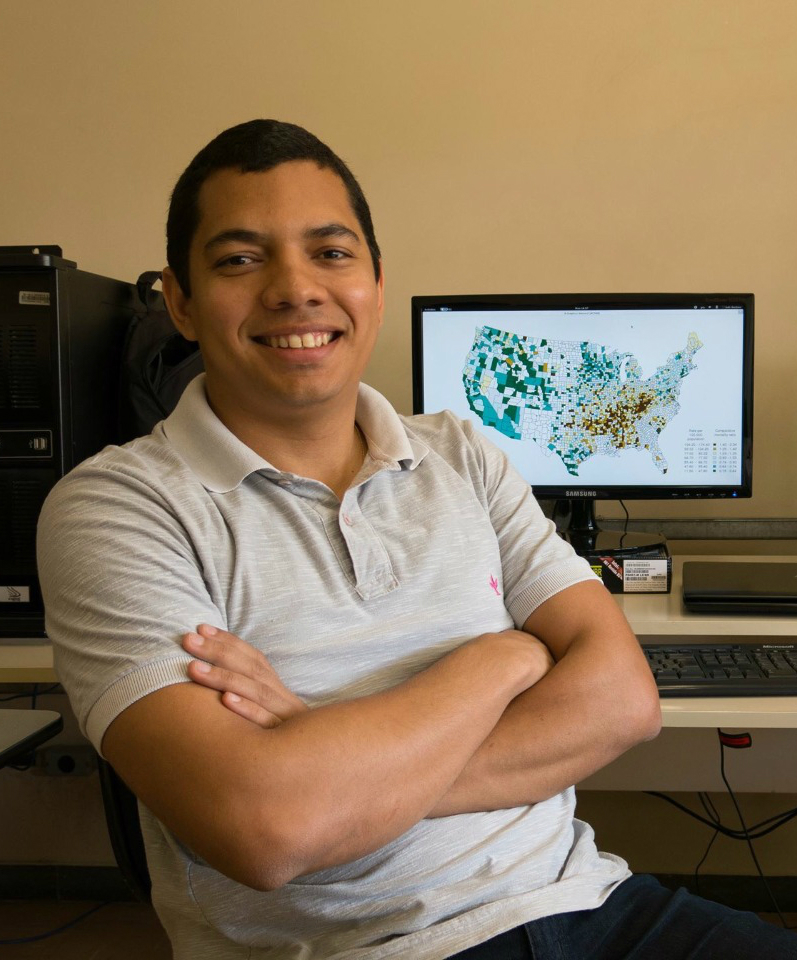

# Luís G. Silva e Silva

<!-- Duas colunas -->

### Description

I obtained a Ph.D. and a Master in Statistics at the Federal University of Minas Gerais (UFMG), with a thesis about “COWORDS: A Probabilistic Model for Text Visualization” and “New tools for visualization of georeferenced data: an integration between R and Google Maps.” I worked in the private sector as a data scientist for marketing and as Research Fellow at the University of Minas Gerais on health and social statistics. During my assignments, I implemented various statistical projects ranging from the development of predictive models in a Hadoop environment to pattern detection on health data using machine learning techniques. In 2013, my master thesis received the award Prêmio de Incentivo em Ciência e Tecnologia para o SUS (Science and technology incentive award for the Brazilian Unified Health System)

***

### Interests

* Statistical computing
* Data visualization
* Spatial data analysis
* Statistical modeling

***

  <a href="https://www.linkedin.com/in/lgsilvaesilva/"> 
    <i class="fa fa-linkedin" style='font-size:20px; margin: 0px 5px'></i>
  </a>
  <a href="https://github.com/lgsilvaesilva"> 
    <i class="fa fa-github" style='font-size:20px; margin: 0px 5px'></i>
  </a>
  <a href="https://twitter.com/lgsilvaesilva"> 
    <i class="fa fa-twitter" style='font-size:20px; margin: 0px 5px'></i>
  </a>

